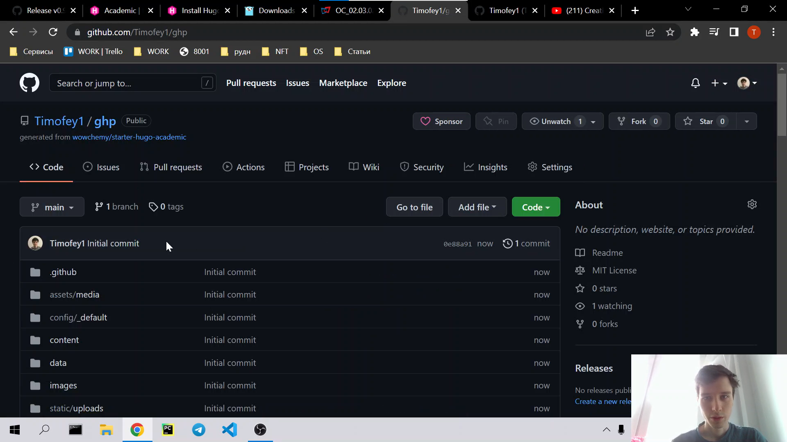
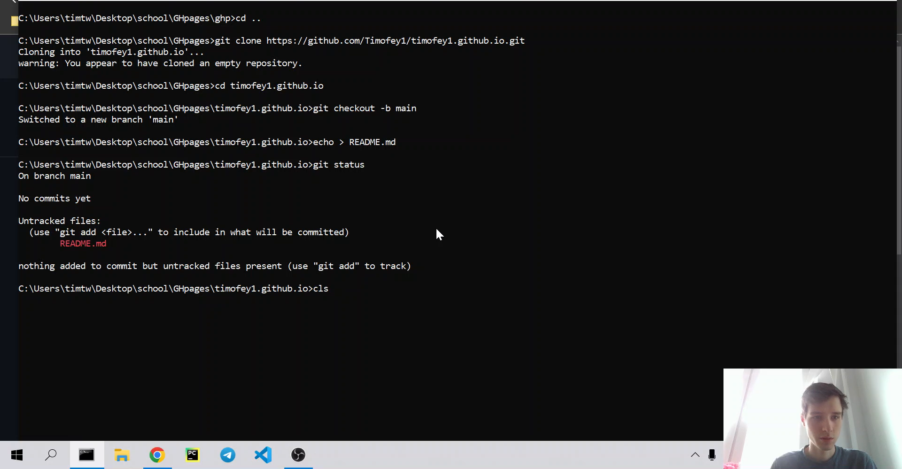
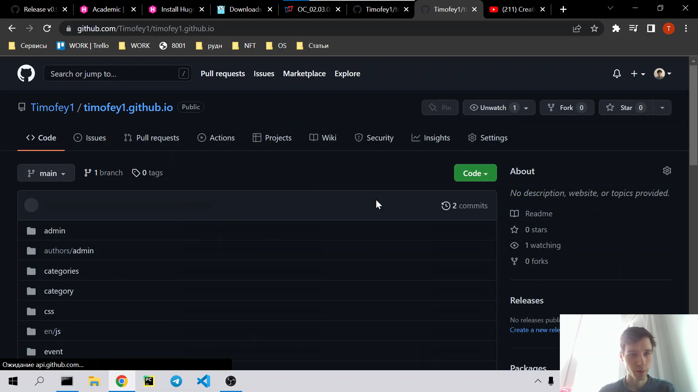

---
# Front matter
lang: ru-RU
title: "Индивидуальный проект. Этап 1"
subtitle: "Размещение шаблона hugo на github pages"
author: "Бешкуров Тимофей Борисович"

# Formatting
toc-title: "Содержание"
toc: true # Table of contents
toc_depth: 2
fontsize: 12pt
linestretch: 1.5
papersize: a4paper
documentclass: scrreprt
polyglossia-lang: russian
polyglossia-otherlangs: english
mainfont: PT Serif
romanfont: PT Serif
sansfont: PT Sans
monofont: PT Mono
mainfontoptions: Ligatures=TeX
romanfontoptions: Ligatures=TeX
sansfontoptions: Ligatures=TeX,Scale=MatchLowercase
monofontoptions: Scale=MatchLowercase
indent: true
pdf-engine: lualatex
header-includes:
  - \linepenalty=10 # the penalty added to the badness of each line within a paragraph (no associated penalty node) Increasing the value makes tex try to have fewer lines in the paragraph.
  - \interlinepenalty=0 # value of the penalty (node) added after each line of a paragraph.
  - \hyphenpenalty=50 # the penalty for line breaking at an automatically inserted hyphen
  - \exhyphenpenalty=50 # the penalty for line breaking at an explicit hyphen
  - \binoppenalty=700 # the penalty for breaking a line at a binary operator
  - \relpenalty=500 # the penalty for breaking a line at a relation
  - \clubpenalty=150 # extra penalty for breaking after first line of a paragraph
  - \widowpenalty=150 # extra penalty for breaking before last line of a paragraph
  - \displaywidowpenalty=50 # extra penalty for breaking before last line before a display math
  - \brokenpenalty=100 # extra penalty for page breaking after a hyphenated line
  - \predisplaypenalty=10000 # penalty for breaking before a display
  - \postdisplaypenalty=0 # penalty for breaking after a display
  - \floatingpenalty = 20000 # penalty for splitting an insertion (can only be split footnote in standard LaTeX)
  - \raggedbottom # or \flushbottom
  - \usepackage{float} # keep figures where there are in the text
  - \floatplacement{figure}{H} # keep figures where there are in the text
---

# Цель работы

Разместить шаблон hugo на github pages

# Выполнение лабораторной работы

1. Установили hugo и добавили его в PATH для удобства вызова из cmd (рис. 1)

{ #fig:001 width=70% }

2. Заходим на github с шаблоном и жмем конпку: "Использовать этот шаблон" (рис. 2)

{ #fig:002 width=70% }

Даем имя репозиторию (Я дал имя ghp) и создаем репозиторий. Он появится в наших репозиториях (рис. 3)

{ #fig:003 width=70% }

3. Создаем новый репозиторий с именем <i>username</i>.github.io (рис. 4)

{ #fig:004 width=70% }

4. Клонирум наш репозиторий с шаблоном. (рис. 5)

{ #fig:005 width=70% }

5. Клонируем наш репозиторий для хранения static файлов (timofey1.github.io). Создаем новую ветку main, в ней создаем рандомный файл, делаем коммит и загружаем на сервер (рис. 6)

{ #fig:006 width=70% }

6. Создаем подмодуль в папке с шаблоном для папки public, куда будут конвертироваться static файлы из hugo (рис 7)

{ #fig:007 width=70% }

7. Собираем сайт командой hugo (рис. 8)

{ #fig:008 width=70% }

Проверка папки public, как можно заметить в ней создалось много файлов для нашего сайта (рис. 9)

{ #fig:009 width=70% }

7. Загружаем это на сервер (рис. 10)

{ #fig:010 width=70% }

8. Заходим на наш сайт (timofey1.github.io) и видим шаблон сайта на github pages (рис. 11)

{ #fig:011 width=70% }

# Вывод

Разметили шаблон сайта hugo на github pages

